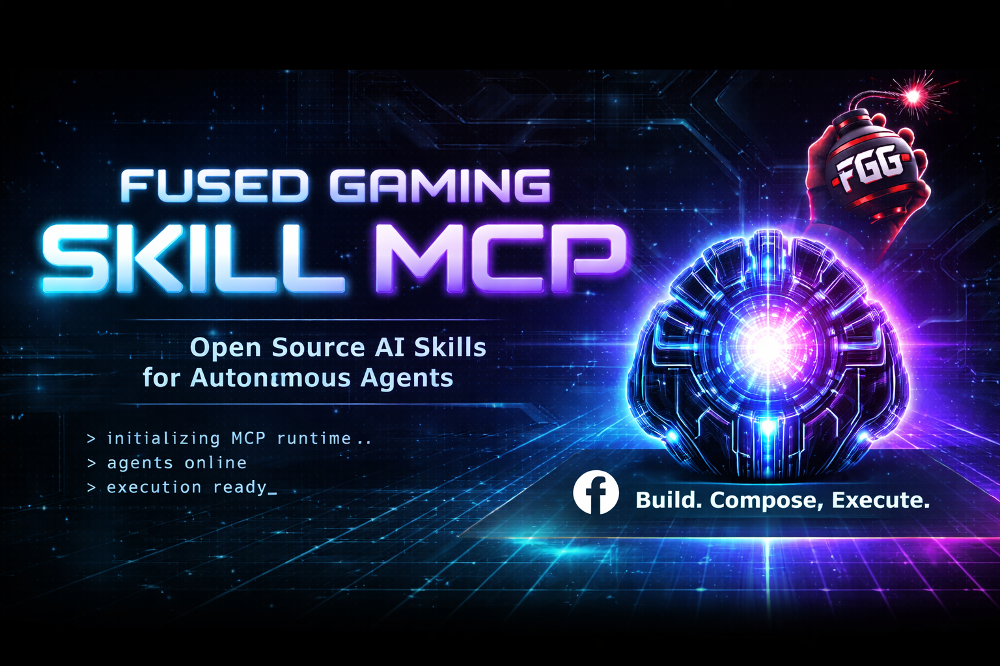

# 🎮 Fused Gaming MCP

<div align="center">



</div>

---

## 📊 Status & Technology

[](https://www.npmjs.com/~h4shed)
[](./LICENSE)
[](https://github.com/Fused-Gaming/Fused-Gaming-Skill-MCP/actions)
[](https://nodejs.org/)
[](https://www.typescriptlang.org/)
[](https://www.npmjs.com/)

---

## 🚀 The Ultimate AI-Powered Skill Ecosystem

**Fused Gaming MCP** is a modular, production-ready Model Context Protocol server with **9 published skills** plus core infrastructure packages.

### 🎯 Your Creative Arsenal Includes:

| Skill | Purpose | Status |
|-------|---------|--------|
| **algorithmic-art** | Generative art using p5.js | ✅ |
| **ascii-mockup** | Mobile-first wireframe designs | ✅ |
| **canvas-design** | SVG-based visual design | ✅ |
| **frontend-design** | HTML/CSS component design | ✅ |
| **theme-factory** | Design system generation | ✅ |
| **mcp-builder** | MCP server scaffolding | ✅ |
| **pre-deploy-validator** | Deployment validation | ✅ |
| **skill-creator** | Custom skill builder | ✅ |
| **underworld-writer** | Character/world narrative generation | ✅ |

**All skills are production-ready and actively maintained** ✨

### 📦 Publishing now / next wave

**Published now (`@h4shed`)**
- `mcp-cli`, `mcp-core`
- `skill-algorithmic-art`, `skill-ascii-mockup`, `skill-canvas-design`
- `skill-frontend-design`, `skill-mcp-builder`, `skill-pre-deploy-validator`
- `skill-skill-creator`, `skill-theme-factory`, `skill-underworld-writer`

**Scaffolded and queued for publish (`@h4shed`)**
- `skill-mermaid-terminal`
- `skill-ux-journeymapper`
- `skill-svg-generator`
- `skill-project-manager`
- `skill-project-status-tool`
- `skill-daily-review`
- `multi-account-session-tracking`
- `skill-linkedin-master-journalist`

---

## ✨ Why Fused Gaming MCP?

Transform your Claude workflow with meticulously crafted tools designed for:

✔️ **Generative Art** — Create algorithmic artwork and visualizations  
✔️ **UI/UX Design** — Build design systems and component libraries  
✔️ **Web Development** — Scaffold projects and validate deployments  
✔️ **Game Development** — Asset generation and rapid prototyping  
✔️ **AI Automation** — Streamline creative and technical workflows  

**Trusted by:** Fused Gaming • VLN Security • Design Studios • AI Development Teams

---

## 🎬 Quick Start (2 Minutes)

### Install

```bash
# Install published packages (active scope: @h4shed)
npm install @h4shed/mcp-core @h4shed/mcp-cli

# Add selected skills
npm install \
  @h4shed/skill-algorithmic-art \
  @h4shed/skill-theme-factory \
  @h4shed/skill-underworld-writer
```

### Initialize & Run

```bash
# Run CLI
npx @h4shed/mcp-cli init

# Add more skills anytime
npx @h4shed/mcp-cli add frontend-design
npx @h4shed/mcp-cli add pre-deploy-validator

# Start the MCP server
npm run dev
```

Done! You're now ready to supercharge Claude. 🔋

---

## 📋 Essential Commands

```bash
fused-gaming-mcp init              # Initialize config
fused-gaming-mcp list              # Show available skills
fused-gaming-mcp add <skill>       # Enable a skill
fused-gaming-mcp remove <skill>    # Disable a skill
fused-gaming-mcp config            # View current config
```

---

## ⚙️ Configuration

Customize via `.fused-gaming-mcp.json`:

```json
{
  "skills": {
    "enabled": ["algorithmic-art", "theme-factory", "frontend-design"],
    "disabled": []
  },
  "auth": {
    "apiKeys": {
      "openai": "sk-..."
    }
  },
  "logging": {
    "level": "info"
  }
}
```

---

## 🏗️ Development

```bash
npm install         # Install dependencies
npm run build       # Build all packages
npm run test        # Run tests
npm run lint        # Check code quality
npm run typecheck   # Validate TypeScript
npm run dev         # Start dev server
```

---

## 📚 Documentation

| Resource | Purpose |
|----------|---------|
| [QUICKSTART.md](./docs/getting-started/QUICKSTART.md) | Get started in minutes |
| [ARCHITECTURE.md](./docs/ARCHITECTURE.md) | System design & internals |
| [SKILLS_GUIDE.md](./docs/SKILLS_GUIDE.md) | Build custom skills |
| [API_REFERENCE.md](./docs/API_REFERENCE.md) | Complete API docs |
| [EXAMPLES.md](./docs/EXAMPLES.md) | Real-world usage patterns |
| [RELEASE_COMMUNICATION.md](./docs/RELEASE_COMMUNICATION.md) | Launch summary + LinkedIn post draft |
| [ROADMAP.md](./docs/ROADMAP.md) | Published/missing/planned skills and priorities |
| [docs/README.md](./docs/README.md) | Documentation index by category |
| [CONTRIBUTING.md](./CONTRIBUTING.md) | How to contribute |

---

## 🗺️ Roadmap Snapshot (Existing + Planned)

### Existing (v1.0.3)
- ✅ 11 published `@h4shed/*` packages (core + CLI + 9 skills)
- ✅ npm workspace publishing pipeline active on `main` and tags
- ✅ Security baseline hardened (0 known vulnerabilities at last audit)

### Planned (next release cycle)
- 🔄 Promote release checklist automation from docs into CI validation gates
- 🔄 Expand deployment verification for npm + GitHub release parity
- 🔄 Add richer release announcement templates for community launch posts

### Current blockers to watch
- GitHub PR/status triage currently depends on repository API/CLI availability in the execution environment.
- Scope configuration (`NPM_SCOPE`) must be set in GitHub Actions variables for organization-owned publishing.

### Top 3 priorities now
1. Ship missing high-impact skills (`mermaid-terminal`, `ux-journeymapper`, `svg-generator`).
2. Add automated docs/package consistency checks for published scope metadata.
3. Track deployment/test status per release PR in a single release checklist.
4. Keep Actions test matrix pinned to active LTS lanes (20.x, 22.x) to avoid Node-version runtime drift.

---

## 🚢 Release Automation

- **npm publish workflow:** `.github/workflows/publish.yml`
  - Runs lint, typecheck, build, scope preparation, and workspace publish.
- **GitHub release workflow:** `.github/workflows/github-release.yml`
  - Runs on the same release tags (`v*`, `skill-*`) and creates GitHub Releases with generated notes.
- This split keeps npm publishing and release-note generation independently observable and easier to retry.

---

## 💡 Use Cases

🎨 **Generative Art** — Create procedural artwork and visual effects  
🖼️ **Design Systems** — Build cohesive UI components and themes  
🛠️ **Development** — MCP builders, validators, and scaffolding  
📱 **Prototyping** — Rapid wireframing and layout design  
🎮 **Game Development** — Asset generation and design automation  

---

## 📦 System Requirements

```
Node.js ≥ 20.0.0
npm ≥ 8.0.0
```

---

## 🤝 Contributing

We'd love your involvement!

- 🐛 **Report Issues** → [GitHub Issues](https://github.com/Fused-Gaming/Fused-Gaming-Skill-MCP/issues)
- 💡 **Suggest Features** → [GitHub Discussions](https://github.com/Fused-Gaming/Fused-Gaming-Skill-MCP/discussions)
- 🤝 **Contribute Code** → [CONTRIBUTING.md](./CONTRIBUTING.md)
- 📧 **Get Support** → [support@fused-gaming.io](mailto:support@fused-gaming.io)

### Contributors

Built with ❤️ by the Fused Gaming Team and community contributors.

---

## 📄 License

Apache 2.0 — See [LICENSE](./LICENSE) for details

---

[](./VERSION.json)
[](./docs/releases/RELEASE_NOTES.md)
[](./CHANGELOG.md)
[](https://github.com/Fused-Gaming/Fused-Gaming-Skill-MCP)
