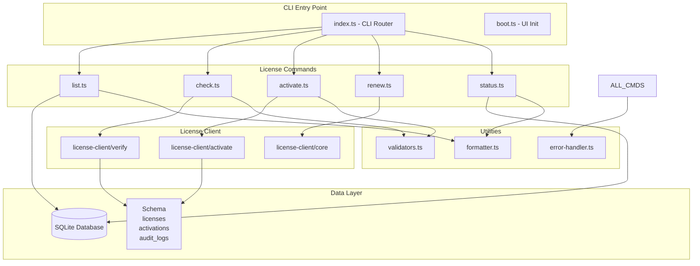
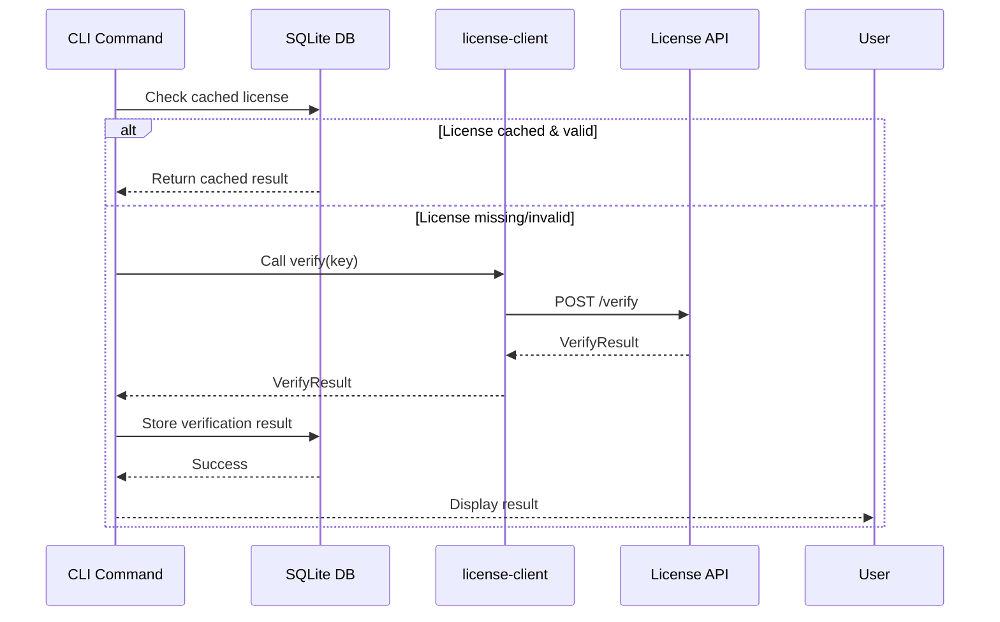

# License CLI Architecture

## Overview

The License CLI subsystem provides command-line and programmatic interfaces for managing software licenses within the Fused Gaming MCP ecosystem. This architecture document outlines the CLI module structure, command routing system, data persistence layer, and integration points with the `@h4shed/license-client` package.

## Architecture Diagram



## CLI Module Structure

### Directory Layout

```
packages/cli/src/
├── commands/
│   ├── license/
│   │   ├── index.ts                 # Command registry
│   │   ├── list.ts                  # List installed licenses
│   │   ├── check.ts                 # Verify license validity
│   │   ├── activate.ts              # Activate new license
│   │   ├── renew.ts                 # Renew expiring license
│   │   ├── status.ts                # License status dashboard
│   │   └── types.ts                 # Command option types
│   ├── skills/
│   │   ├── add.ts                   # Add skill
│   │   ├── remove.ts                # Remove skill
│   │   └── list.ts                  # List skills
│   └── index.ts                     # Command routing
├── utils/
│   ├── license-validation.ts        # License format validation
│   ├── license-error-handler.ts     # Error mapping & recovery
│   ├── license-formatter.ts         # Output formatting
│   └── database.ts                  # SQLite connection pool
├── db/
│   ├── schema.ts                    # License schema definition
│   ├── migrations.ts                # Schema versioning
│   └── seeds.ts                     # Initial data
├── ui/
│   ├── boot.ts                      # Bootstrap UI
│   ├── menu.ts                      # Main menu
│   ├── syncpulse.ts                 # Dashboard
│   └── license-panel.ts             # License UI
├── index.ts                         # Entry point & router
└── types.ts                         # Global types
```

### File Responsibilities

#### Command Files

**`commands/license/list.ts`**
- List all installed licenses
- Display license keys, expiration, status
- Filter by status (active, expired, pending)
- Output as table, JSON, or CSV

**`commands/license/check.ts`**
- Verify license validity (format, signature)
- Check license expiration
- Validate license key against backend
- Return detailed validation report

**`commands/license/activate.ts`**
- Accept license key input
- Validate key format
- Register with backend license-client
- Store encrypted key in database
- Return activation status

**`commands/license/renew.ts`**
- Accept renewal token or new key
- Update license in database
- Request license extension from backend
- Handle renewal failures

**`commands/license/status.ts`**
- Display license status dashboard
- Show expiration timeline
- Display active features
- Show usage metrics

#### Utility Files

**`utils/license-validation.ts`**
- Validate license key format (regex patterns)
- Check key length and structure
- Verify checksum/signature
- Validate product codes

**`utils/license-error-handler.ts`**
- Map license errors to user messages
- Handle network failures
- Handle database errors
- Provide recovery suggestions

**`utils/license-formatter.ts`**
- Format license keys for display
- Format expiration dates (relative/absolute)
- Color-code status indicators
- Generate ASCII tables

**`utils/database.ts`**
- Initialize SQLite connection
- Connection pooling
- Transaction management
- Migration handling

## SQLite Schema Design

### Table: licenses

```sql
CREATE TABLE IF NOT EXISTS licenses (
  id TEXT PRIMARY KEY,                      -- UUID v4
  key TEXT UNIQUE NOT NULL,                 -- License key (encrypted)
  product_code VARCHAR(50) NOT NULL,        -- Product identifier
  status VARCHAR(20) NOT NULL               -- active|expired|suspended|pending
    CHECK (status IN ('active', 'expired', 'suspended', 'pending')),
  
  -- Metadata
  issued_at TIMESTAMP NOT NULL,
  expires_at TIMESTAMP NOT NULL,
  activated_at TIMESTAMP,
  last_verified_at TIMESTAMP,
  
  -- License Details
  owner_name VARCHAR(255),
  owner_email VARCHAR(255),
  license_type VARCHAR(50),                 -- commercial|personal|trial
  tier VARCHAR(50),                         -- basic|pro|enterprise
  
  -- Tracking
  device_id TEXT,
  activation_count INTEGER DEFAULT 0,
  max_activations INTEGER,
  
  -- Metadata
  metadata JSONB,                           -- {custom_fields, notes}
  created_at TIMESTAMP DEFAULT CURRENT_TIMESTAMP,
  updated_at TIMESTAMP DEFAULT CURRENT_TIMESTAMP,
  
  -- Indexes
  INDEX idx_status (status),
  INDEX idx_expires_at (expires_at),
  INDEX idx_product_code (product_code),
  INDEX idx_owner_email (owner_email)
);
```

### Table: activations

```sql
CREATE TABLE IF NOT EXISTS activations (
  id TEXT PRIMARY KEY,                      -- UUID v4
  license_id TEXT NOT NULL REFERENCES licenses(id),
  activation_key TEXT UNIQUE,               -- Derived from license key + salt
  device_id TEXT NOT NULL,
  device_name VARCHAR(255),
  device_type VARCHAR(50),                  -- desktop|mobile|server
  
  -- Lifecycle
  activated_at TIMESTAMP NOT NULL,
  deactivated_at TIMESTAMP,
  last_accessed_at TIMESTAMP,
  status VARCHAR(20) NOT NULL
    CHECK (status IN ('active', 'revoked', 'suspended')),
  
  -- Metadata
  ip_address INET,
  user_agent TEXT,
  metadata JSONB,
  
  created_at TIMESTAMP DEFAULT CURRENT_TIMESTAMP,
  updated_at TIMESTAMP DEFAULT CURRENT_TIMESTAMP,
  
  INDEX idx_license_id (license_id),
  INDEX idx_device_id (device_id),
  INDEX idx_status (status)
);
```

### Table: audit_logs

```sql
CREATE TABLE IF NOT EXISTS audit_logs (
  id BIGSERIAL PRIMARY KEY,
  license_id TEXT REFERENCES licenses(id),
  action VARCHAR(100) NOT NULL,             -- activate|verify|renew|expire|suspend
  result VARCHAR(20),                       -- success|failure
  
  -- Context
  user_id TEXT,
  ip_address INET,
  user_agent TEXT,
  
  -- Details
  error_message TEXT,
  metadata JSONB,
  
  created_at TIMESTAMP DEFAULT CURRENT_TIMESTAMP,
  
  INDEX idx_license_id (license_id),
  INDEX idx_action (action),
  INDEX idx_created_at (created_at)
);
```

## Command Routing System

### Command Registry Pattern

```typescript
// commands/index.ts
interface CommandDefinition {
  name: string;
  group: 'license' | 'skills' | 'config';
  handler: (argv: Arguments) => Promise<void>;
  options?: Record<string, OptionDefinition>;
  description: string;
  aliases?: string[];
}

interface OptionDefinition {
  type: 'string' | 'number' | 'boolean' | 'array';
  description: string;
  required?: boolean;
  default?: unknown;
  choices?: unknown[];
}

const commands: CommandDefinition[] = [
  {
    name: 'license:list',
    group: 'license',
    aliases: ['licenses', 'll'],
    description: 'List installed licenses',
    handler: listLicenses,
    options: {
      format: {
        type: 'string',
        description: 'Output format',
        default: 'table',
        choices: ['table', 'json', 'csv']
      },
      status: {
        type: 'string',
        description: 'Filter by status',
        choices: ['active', 'expired', 'pending', 'suspended']
      }
    }
  },
  {
    name: 'license:check',
    group: 'license',
    aliases: ['lc'],
    description: 'Verify license validity',
    handler: checkLicense,
    options: {
      key: {
        type: 'string',
        description: 'License key',
        required: true
      },
      verbose: {
        type: 'boolean',
        description: 'Show detailed validation steps',
        default: false
      }
    }
  },
  // ... more commands
];
```

### Dynamic Command Loading

```typescript
// Lazy load command modules
async function loadCommand(commandName: string): Promise<CommandDefinition | null> {
  try {
    const [group, subcommand] = commandName.split(':');
    const module = await import(`./commands/${group}/${subcommand}.js`);
    return module.default as CommandDefinition;
  } catch (error) {
    return null;
  }
}

// Yargs Integration
export function createCommandRouter(yargs: Argv) {
  for (const command of commands) {
    yargs.command(
      command.name,
      command.description,
      (y: Argv) => {
        for (const [key, option] of Object.entries(command.options ?? {})) {
          y.option(key, {
            type: option.type,
            description: option.description,
            required: option.required,
            default: option.default,
            choices: option.choices
          });
        }
        return y;
      },
      (argv: Arguments) => command.handler(argv)
    );
  }
  return yargs;
}
```

## Integration Points with license-client

### License Client API Contract

```typescript
// Imported from @h4shed/license-client
export interface ILicenseClient {
  // Verification
  verify(key: string): Promise<VerifyResult>;
  verifyBatch(keys: string[]): Promise<VerifyResult[]>;
  
  // Activation
  activate(key: string, deviceId: string): Promise<ActivationResult>;
  deactivate(activationKey: string): Promise<void>;
  
  // Status
  getStatus(key: string): Promise<LicenseStatus>;
  getActivations(key: string): Promise<Activation[]>;
  
  // Renewal
  renew(key: string, token: string): Promise<RenewalResult>;
  extend(key: string, duration: number): Promise<ExtensionResult>;
}

export interface VerifyResult {
  valid: boolean;
  key: string;
  productCode: string;
  expiresAt: Date;
  status: 'active' | 'expired' | 'invalid' | 'suspended';
  features: string[];
  validatedAt: Date;
  signature: string;
}

export interface ActivationResult {
  activated: boolean;
  activationKey: string;
  licenseKey: string;
  expiresAt: Date;
  maxActivations: number;
  currentActivations: number;
}
```

### Integration Flow Diagram



## Error Handling and Validation Flow

### Validation Pipeline

```
Input → Format Check → Structure Check → Signature Check → Backend Verify → Store
   ↓         ↓              ↓               ↓                ↓               ↓
 Raw       RegEx         Checksum       Crypto          API Call        SQLite
  Key      Pattern        Verify        Validate        Request         Insert
```

### Error Categories and Responses

```typescript
enum LicenseErrorCode {
  // Format errors
  INVALID_FORMAT = 'ERR_LICENSE_INVALID_FORMAT',
  INVALID_LENGTH = 'ERR_LICENSE_INVALID_LENGTH',
  INVALID_CHECKSUM = 'ERR_LICENSE_INVALID_CHECKSUM',
  
  // Validity errors
  EXPIRED = 'ERR_LICENSE_EXPIRED',
  NOT_YET_ACTIVE = 'ERR_LICENSE_NOT_YET_ACTIVE',
  SUSPENDED = 'ERR_LICENSE_SUSPENDED',
  
  // Activation errors
  MAX_ACTIVATIONS_EXCEEDED = 'ERR_MAX_ACTIVATIONS_EXCEEDED',
  DEVICE_NOT_AUTHORIZED = 'ERR_DEVICE_NOT_AUTHORIZED',
  
  // Backend errors
  BACKEND_UNAVAILABLE = 'ERR_BACKEND_UNAVAILABLE',
  BACKEND_INVALID_RESPONSE = 'ERR_BACKEND_INVALID_RESPONSE',
  
  // Database errors
  DATABASE_ERROR = 'ERR_DATABASE_ERROR',
  DUPLICATE_LICENSE = 'ERR_DUPLICATE_LICENSE'
}

interface LicenseError extends Error {
  code: LicenseErrorCode;
  details?: Record<string, unknown>;
  recovery?: string;
}

function mapErrorToUserMessage(error: LicenseError): string {
  const messages: Record<LicenseErrorCode, string> = {
    [LicenseErrorCode.INVALID_FORMAT]: 
      'License key format is invalid. Expected format: XXXX-XXXX-XXXX-XXXX',
    [LicenseErrorCode.EXPIRED]:
      'License has expired. Run "license renew" to renew your license.',
    [LicenseErrorCode.MAX_ACTIVATIONS_EXCEEDED]:
      'Maximum device activations reached. Deactivate an unused device to proceed.',
    [LicenseErrorCode.BACKEND_UNAVAILABLE]:
      'License server is temporarily unavailable. Your cached license is still valid.',
    // ... more mappings
  };
  
  return messages[error.code] || 'An unknown license error occurred.';
}
```

### Validation Rules

```typescript
// License Key Format Validation
const LICENSE_KEY_PATTERN = /^[A-Z0-9]{4}-[A-Z0-9]{4}-[A-Z0-9]{4}-[A-Z0-9]{4}$/;

interface LicenseKeyValidator {
  validateFormat(key: string): ValidationResult;
  validateChecksum(key: string): ValidationResult;
  validateStructure(key: string): ValidationResult;
}

interface ValidationResult {
  valid: boolean;
  errors: ValidationError[];
  warnings: string[];
}

interface ValidationError {
  field: string;
  message: string;
  suggestion?: string;
}

// Validation Rules
const validationRules = {
  key: {
    minLength: 19,
    maxLength: 19,
    pattern: LICENSE_KEY_PATTERN,
    checksum: luhnChecksum
  },
  deviceId: {
    minLength: 10,
    maxLength: 100,
    pattern: /^[a-f0-9\-]+$/i
  },
  email: {
    pattern: /^[^\s@]+@[^\s@]+\.[^\s@]+$/,
    maxLength: 255
  }
};
```

## Command Execution Flow Example: License Activation

```
User Input
  ↓
Parse Arguments (yargs)
  ↓
Validate Input (format, length, pattern)
  ↓
Load from Database (check if already activated)
  ↓
Call license-client.activate(key, deviceId)
  ↓
  ├─ [Success] → Store in Database → Update audit log → Display success
  ├─ [Network Error] → Retry with exponential backoff → Suggest manual retry
  ├─ [Invalid Key] → Validate locally → Suggest contacting support
  └─ [Max Activations] → List current activations → Suggest deactivation
```

## Deployment Architecture

### CLI Package Distribution

```yaml
packages/cli/
  package.json:
    main: "./dist/index.js"
    bin:
      fused-gaming-mcp: "./dist/index.js"
    dependencies:
      - yargs                  # CLI argument parsing
      - @h4shed/license-client # License operations
      - better-sqlite3         # Database (sync)
      - chalk                  # Output colors
      - inquirer               # Interactive prompts
  
  src/
    commands/license/         # License command modules
    utils/                    # Shared utilities
    db/                       # Database utilities
    types.ts                  # Type definitions
    index.ts                  # CLI entry point

  dist/                       # Compiled output (tracked in bin)
```

### Database Location

```
~/.fused-gaming-mcp/
├── config.json
└── licenses.db              # SQLite database file
```

### Configuration File

```json
{
  "licenseManager": {
    "databasePath": "~/.fused-gaming-mcp/licenses.db",
    "backend": {
      "apiUrl": "https://license-api.fused-gaming.io",
      "retryAttempts": 3,
      "retryDelay": 1000,
      "timeout": 10000
    },
    "cache": {
      "ttl": 86400,
      "maxSize": 100
    },
    "encryption": {
      "algorithm": "aes-256-gcm",
      "keyDerivation": "pbkdf2"
    }
  }
}
```

## Testing Strategy

### Unit Tests

```typescript
// __tests__/utils/license-validation.test.ts
describe('License Validation', () => {
  describe('validateFormat', () => {
    test('accepts valid license format', () => {
      const result = validator.validateFormat('ABCD-1234-EFGH-5678');
      expect(result.valid).toBe(true);
    });
    
    test('rejects invalid length', () => {
      const result = validator.validateFormat('ABCD-1234');
      expect(result.valid).toBe(false);
    });
  });
});
```

### Integration Tests

```typescript
// __tests__/commands/license/activate.integration.test.ts
describe('License Activation', () => {
  test('activates valid license key', async () => {
    const result = await activateLicense({
      key: 'XXXX-XXXX-XXXX-XXXX',
      deviceId: 'device-123'
    });
    expect(result.success).toBe(true);
    expect(result.activation).toBeDefined();
  });
});
```

## Future Enhancements

1. **License Server Implementation** - Replace license-client mock with real backend
2. **Offline Mode** - Extended cache TTL and offline verification
3. **License Sharing** - Team/organization license pools
4. **Usage Analytics** - Track feature usage per license
5. **License Marketplace** - Buy/sell/transfer licenses

## References

- License Client Package: `/packages/license-client`
- CLI Package: `/packages/cli`
- Design Tokens: `@h4shed/design-tokens`
- Main README: `/README.md`
