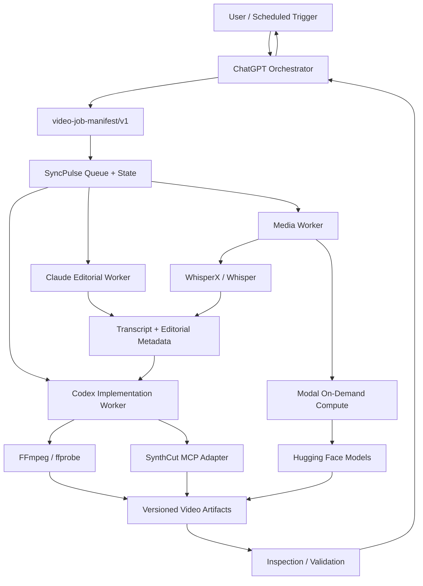
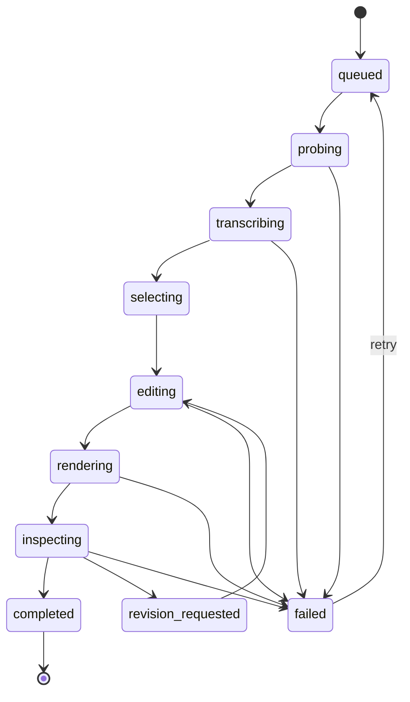
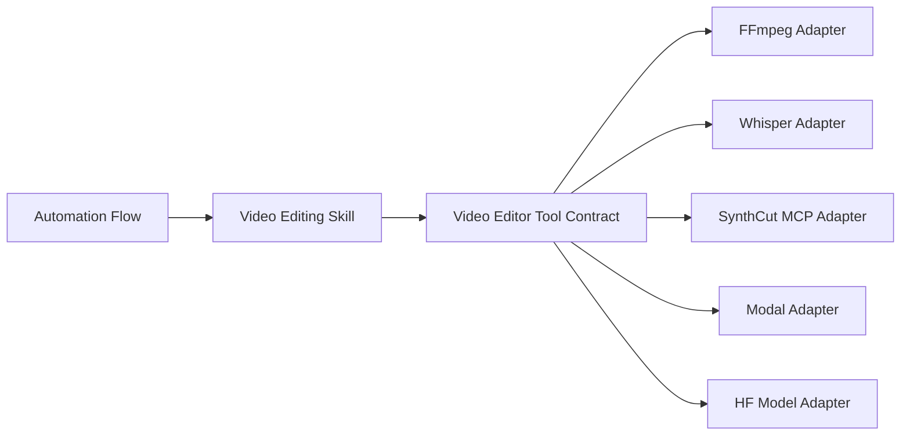
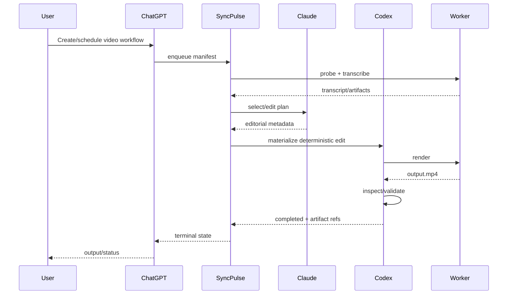

# Cross-Agent Video Automation Architecture

This document is the canonical cross-Claude, Codex, ChatGPT, and SyncPulse reference for automated video editing.

## Objective

Provide one shared architecture where conversational agents, coding agents, editorial agents, and schedulers can cooperate on the same video job without duplicating state or binding the repository to a single paid rendering vendor.



## Responsibility split

| Layer | Primary owner | Responsibilities |
|---|---|---|
| User interaction | ChatGPT | Resolve intent, sources, automation schedule, connector interactions, approvals, delivery |
| Editorial reasoning | Claude | Transcript analysis, clip selection, narrative ordering, alternate cuts, qualitative review |
| Implementation | Codex | Tool adapters, manifests, FFmpeg operations, tests, render logic, CI, remote-worker code |
| Coordination | SyncPulse | Queue, retries, fan-out/fan-in, ownership, durable cross-agent state |
| Media execution | Worker | FFmpeg, WhisperX, rendering, optional GPU/model execution |
| Model registry | Hugging Face | Open model weights for transcription, semantic vision, segmentation, generation |
| Elastic compute | Modal | Short-lived CPU/GPU workers; never the source of workflow truth |

## Canonical state model

The job manifest, not any individual chat, is the source of truth for an edit.



Each state transition records the acting agent, attempt, timestamps, inputs, outputs, and errors. Completed operations are immutable history. Revisions append new operations and artifacts instead of overwriting previous outputs.

## Cost architecture

The default route is intentionally asymmetric:

```text
Metadata/probe/cut/encode     -> local CPU / FFmpeg
Transcription                -> local WhisperX when viable
Large transcription          -> Modal GPU only for that stage
Semantic scene search        -> cached CLIP embeddings
Subject tracking             -> SAM2 only when required
Motion graphics              -> FFmpeg or optional Remotion
Generative video/B-roll      -> explicit opt-in, bounded GPU worker
Final render                 -> CPU unless GPU encoding materially helps
```

This prevents the common anti-pattern of holding a GPU for an entire editing job when only a few stages need acceleration.

## Tool, skill, and automation layers



- Tool contract: `.codex/tools/video-editor/tool.json`
- Tool guide: `.codex/tools/video-editor/README.md`
- Skill: `.codex/skills/video-editing/SKILL.md`
- Reusable flows: `.codex/automation/video-editing-flows.json`

## ChatGPT automation flow

ChatGPT schedules or receives a trigger, resolves the source artifact through an available connector, writes a new manifest, and submits or hands it to SyncPulse. It should not encode video itself. When the job reaches an approval or terminal state, ChatGPT surfaces the artifact and relevant metadata to the user.



## Claude flow

Claude receives transcript, source metadata, user intent, and prior revision history. Claude returns structured editorial metadata rather than a final binary artifact. Candidate clip selections must include timestamps and rationale; subjective choices should remain revisionable.

## Codex flow

Codex consumes manifests and structured editorial metadata. It owns deterministic implementation: adapter code, FFmpeg filters, timeline construction, validation, tests, and reproducible outputs. Codex should keep renderer-specific details behind the `video-editor` contract.

## SyncPulse flow

SyncPulse should become the durable state coordinator when integration is available. Video jobs are particularly suitable for fan-out/fan-in: one transcript can produce several clip child jobs, each rendered independently and collected into a parent job.

## Automation patterns

The initial reusable patterns are:

1. `daily-social-cut`: scheduled long-form to vertical clip.
2. `podcast-to-clips`: transcript once, select many, parallel render.
3. `revision-loop`: preserve prior artifacts and rerender only changed stages.
4. `generative-broll`: explicit opt-in path for model-generated video inserts.

Definitions live in `.codex/automation/video-editing-flows.json`.

## Security and reliability

- Treat remote media URLs and subtitle text as untrusted input.
- Do not interpolate user strings directly into shell commands; construct argument arrays.
- Keep credentials in runtime secret stores, never manifests.
- Hash or fingerprint source artifacts so a resumed job can detect changed inputs.
- Bound render duration, dimensions, frame rate, disk use, and worker lifetime.
- Preserve stdout/stderr and renderer version in failure metadata.
- Validate output with ffprobe before declaring completion.
- Keep publishing as a separate permissioned step from rendering.

## Implementation roadmap

Phase 1 is a local FFmpeg + manifest MVP. Phase 2 adds WhisperX and cached transcripts. Phase 3 adds Modal execution for selected expensive operations. Phase 4 wraps SynthCut or equivalent MCP operations behind the stable adapter. Phase 5 integrates SyncPulse durable queues and automated fan-out. Optional CLIP, SAM2, and generative-video workers come only after the deterministic pipeline is reliable.

## Design rule

The repository owns the workflow contract and state model. FFmpeg, SynthCut, Modal, Hugging Face, Claude, Codex, and ChatGPT are replaceable execution or reasoning components behind that contract.
