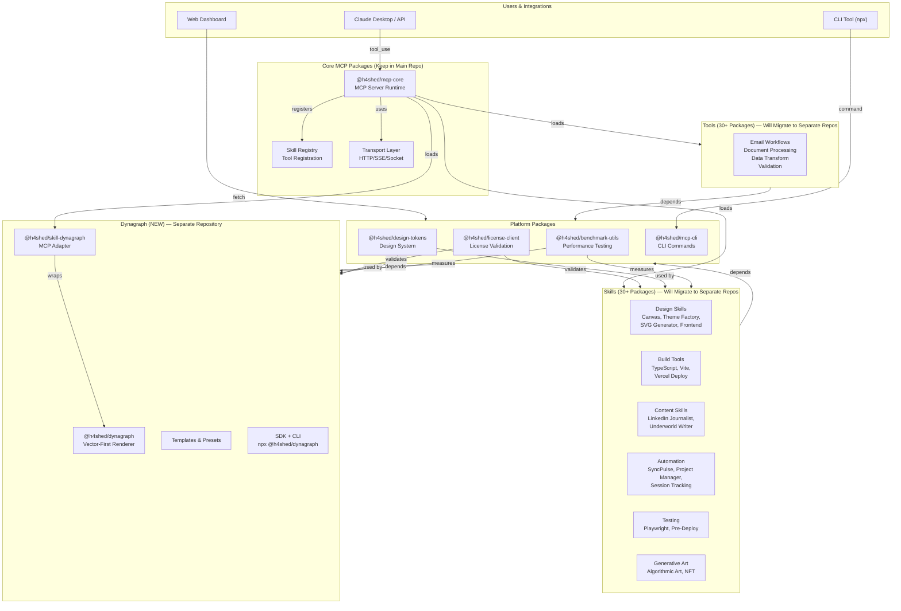
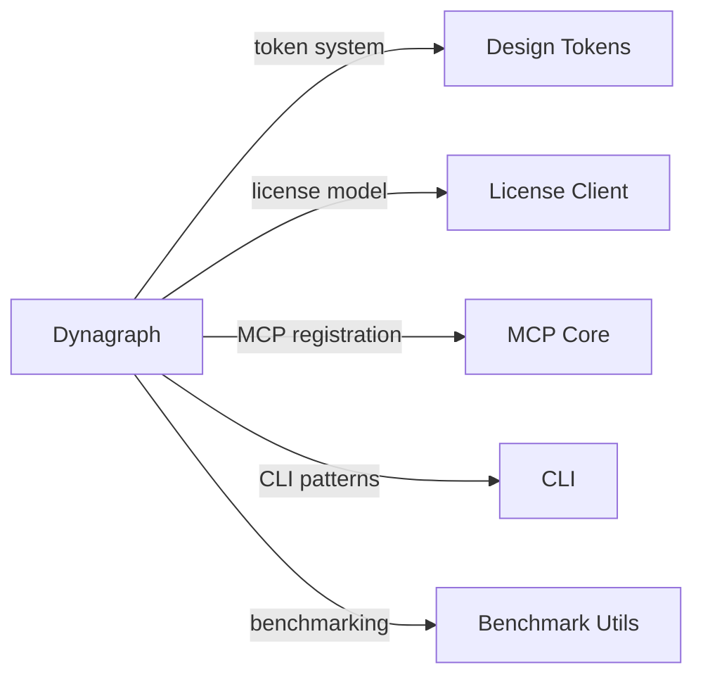
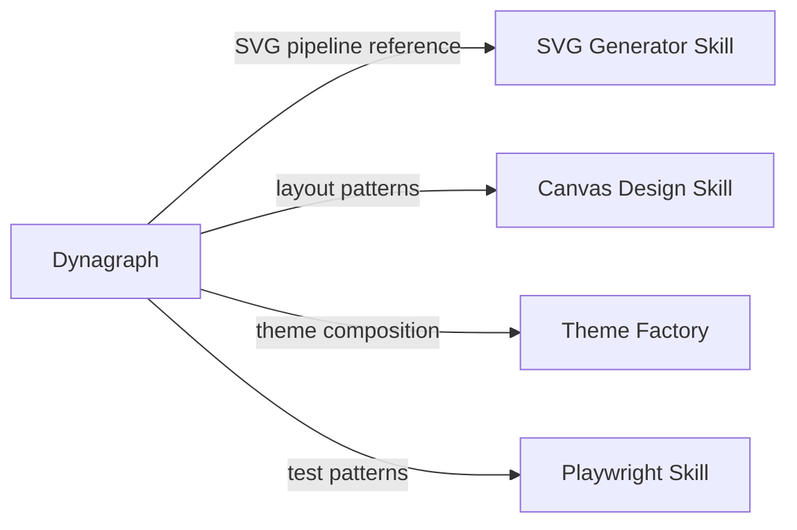
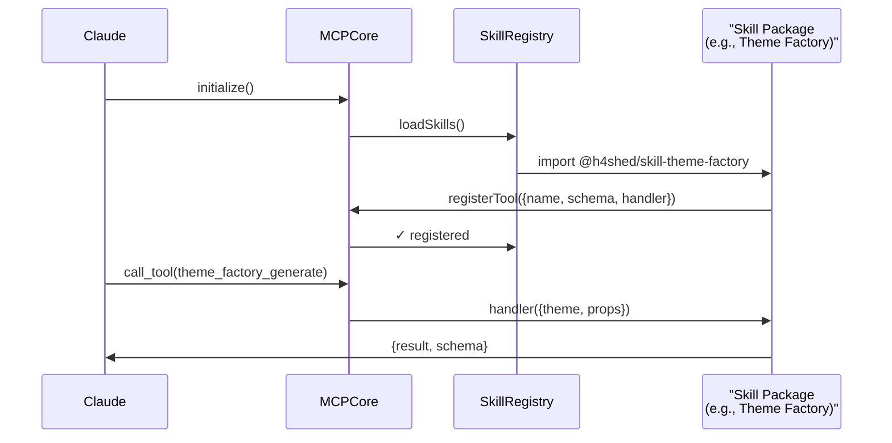
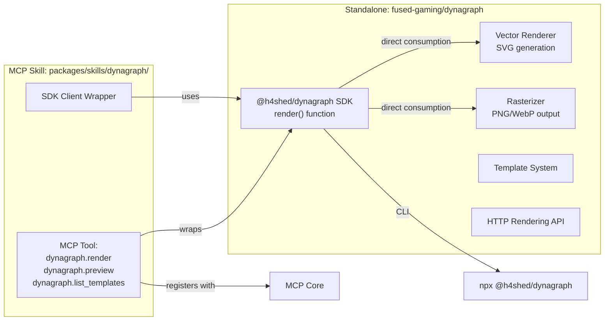

# Fused Gaming MCP Architecture Graph

**Status:** Current state (v1.4.1)  
**Future Vision:** Multi-repository architecture with federated skill discovery  
**Dynagraph Role:** New standalone repository + MCP skill adapter

---

## 1. High-Level System Architecture

### Current Monorepo Structure



---

## 2. Dependency Tree — Current State

### Deepest Dependencies

```
Claude
  └─ MCP Core
      ├─ Transport Layer
      ├─ Registry
      │   └─ [Skills loaded dynamically]
      │   └─ [Tools loaded dynamically]
      ├─ License Client
      │   └─ Telemetry
      ├─ Design Tokens
      └─ [External: TypeScript, Node]

Skills (all depend on Core + Platform)
  ├─ Design Skills
  │   ├─ Design Tokens
  │   ├─ Canvas/SVG rendering
  │   └─ Layout primitives
  ├─ Build Tools
  │   ├─ CLI
  │   └─ TypeScript
  ├─ Content Skills
  │   ├─ API integrations
  │   └─ Text processing
  └─ Automation
      ├─ SyncPulse (complex)
      ├─ Project management
      └─ Workflows
```

---

## 3. Skill Categories & Reusability for Dynagraph

### Tier 1: Direct Reuse (No Modification)

These packages Dynagraph will consume without change:



---

### Tier 2: Extend or Reference

These packages provide patterns Dynagraph adapts:



---

### Tier 3: Not Applicable

These packages are orthogonal:

- SyncPulse (multi-agent orchestration)
- Content skills (writing, journalism)
- Generative art (procedural art, not OG rendering)
- Session tracking
- Blockchain tools

---

## 4. Technology Stack Snapshot

### Core MCP

| Layer | Technology | Version |
|-------|-----------|---------|
| Runtime | Node.js | >= 20.0.0 |
| Language | TypeScript | 5.3.2 |
| HTTP | Express (implied) | — |
| Build | TypeScript compiler | 5.3.2 |
| Testing | Jest (implied) | — |

### Skills Ecosystem

| Category | Technologies |
|----------|--------------|
| Rendering | None (opportunity for Dynagraph) |
| Styling | Tailwind, Style Dictionary |
| SVG | Canvas, SVG Generator |
| UI | React (web only), Framer Motion |
| Asset Management | File system, CDN (implied) |
| Fonts | System fonts (default) |

### Dynagraph Will Need

| Component | Candidates | Status |
|-----------|-----------|--------|
| Rendering | Satori, Skia.js, Canvas | TBD |
| Rasterization | Sharp, libvips, Playwright | TBD |
| Server | Express or Hono | TBD |
| Template Engine | Custom (Dynagraph-specific) | To Design |

---

## 5. Multi-Repository Vision

### Phase 2+: After Migration

```mermaid
flowchart TB
    subgraph Claude ["Claude Desktop / API"]
        C["Claude"]
    end

    subgraph Main ["fused-gaming/fused-gaming-skill-mcp"]
        Core["MCP Core<br/>CLI<br/>License Client<br/>Benchmark Utils<br/>Docs"]
    end

    subgraph SyncPulse ["fused-gaming/syncpulse"]
        SP["SyncPulse<br/>Agent Orchestration<br/>Workflows"]
    end

    subgraph Design ["fused-gaming/design-system"]
        DS["Design Tokens<br/>Theme Factory<br/>Style Dictionary<br/>Tailwind Builder"]
    end

    subgraph Skills ["fused-gaming/skills"]
        Skills["Design Skills<br/>Build Tools<br/>Content Skills<br/>Testing<br/>Generative Art"]
    end

    subgraph Dynagraph ["fused-gaming/dynagraph"]
        DG["Dynagraph SDK<br/>Renderer<br/>Templates<br/>API<br/>MCP Skill"]
    end

    C -->|tools| Main
    Main -->|discovers| Skills
    Main -->|discovers| SyncPulse
    Main -->|uses| Design
    Main -->|discovers| Dynagraph

    Skills -->|depends| Design
    Dynagraph -->|depends| Design
    Dynagraph -->|integrates| Main
```

---

## 6. Integration Pattern: How Skills Integrate with Core

### MCP Skill Registration Flow



---

## 7. Dynagraph Integration Example

### How Dynagraph Adapter Fits



---

## 8. Licensing Boundaries

### Apache-2.0 Boundary (Current)

```
fused-gaming/fused-gaming-skill-mcp (Apache-2.0)
├── packages/core
├── packages/cli
├── packages/license-client
├── packages/design-tokens
└── [all skills] — keep Apache-2.0
```

### Dynagraph Licensing (NEW)

```
fused-gaming/dynagraph (PolyForm Noncommercial 1.0.0 + Commercial License)
├── @h4shed/dynagraph (dual-licensed)
├── @h4shed/dynagraph-templates (dual-licensed)
└── @h4shed/skill-dynagraph (Apache-2.0 — MCP adapter remains permissive)
```

**Note:** Adapter remains Apache-2.0 for MCP integration. Only core Dynagraph packages use source-available licensing.

---

## 9. Deployment Architecture

### API Deployment Pattern

```
Claude Desktop
    ↓
MCP Stdio Transport
    ↓
MCP Core Server (Local)
    ↓ (calls tool)
Dynagraph Skill
    ↓
Dynagraph SDK (in-process or HTTP)
    ↓
Rendering Pipeline
    ↓
PNG/SVG Output
```

### Optional: Hosted Rendering API

```
Dynagraph CLI / SDK
    ↓
https://dynagraph.h4shed.dev/v1/render
    ↓
Rendering Service (Vercel Functions or similar)
    ↓
CDN (for generated assets)
```

---

## 10. Key Metrics: Package Inventory Summary

| Metric | Count |
|--------|-------|
| **Core Packages** (keep in main repo) | 6 |
| **Skills** (30+ spread across 5 future repos) | 30+ |
| **Tools** (separate repo) | 30+ |
| **Total Workspace Packages** | 60+ |
| **Published npm Packages** (v1.4.1) | 19 |
| **Dynagraph New Packages** (proposed) | 4-5 |

---

## Next Steps

1. **PACKAGE-INVENTORY.md** ✅ — Individual package details
2. **PACKAGE-GRAPH.md** ✅ (this file) — System architecture
3. **DYNAGRAPH-INTEGRATION.md** — Dynagraph-specific integration
4. **DEPENDENCY-LICENSE-AUDIT.md** — License analysis
5. **LICENSING-STRATEGY.md** — Commercial licensing design
6. **CLEAN-ROOM.md** — Clean-room development record

---

**Generated:** 2026-08-29  
**Branch:** `claude/dynagraph-architecture-audit-6r5740`
