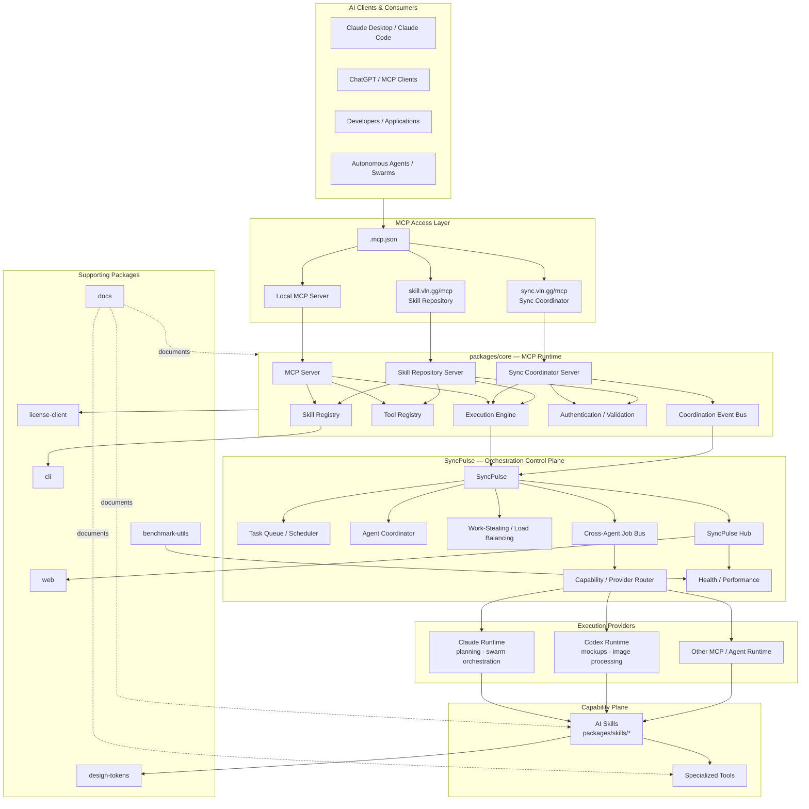
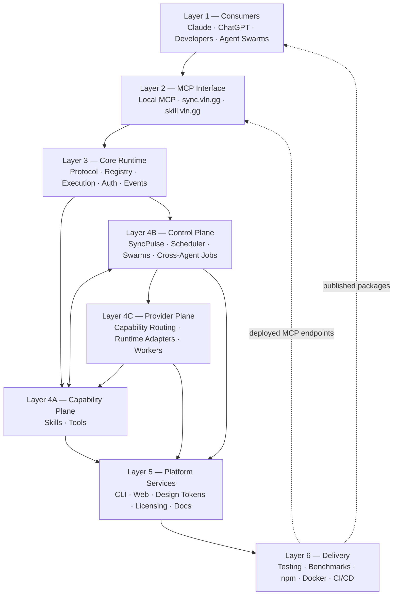
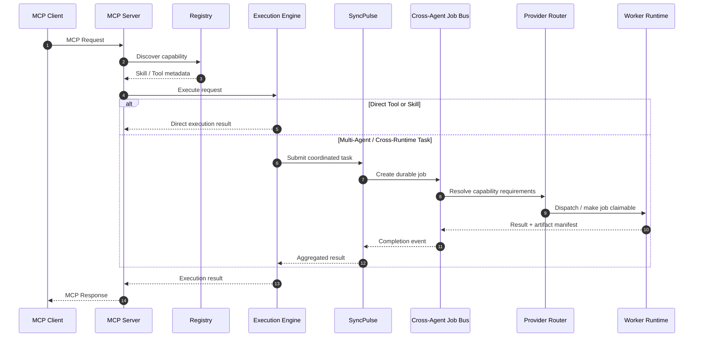
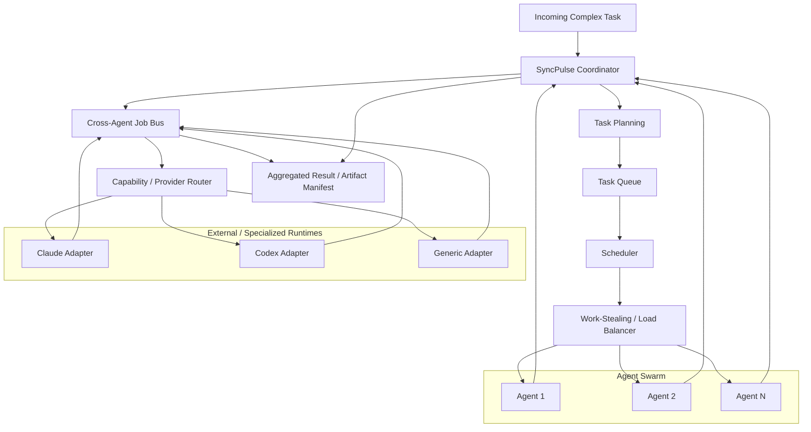
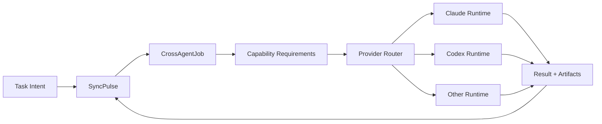
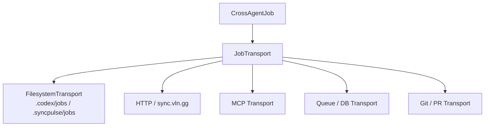
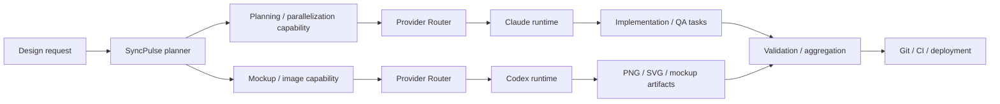

# Fused Gaming Skill MCP — Repository Architecture

> Repository: `Fused-Gaming/Fused-Gaming-Skill-MCP`  
> Package: `@h4shed/mcp`  
> Runtime: Node.js 20+ / TypeScript  
> Architecture: MCP Runtime + Skills + Tools + SyncPulse Multi-Agent Orchestration

## 1. High-Level Repository Architecture



## 2. Logical Layer Model



## 3. Core MCP Request Flow



## 4. SyncPulse Multi-Agent Architecture



## 5. Control Plane vs Capability Plane vs Provider Plane

The repository can be modeled as three operational planes.

### Control Plane

SyncPulse determines what work should execute, when it should execute, how work is synchronized, and how work is redistributed. The cross-agent job bus belongs here because it owns durable task state, claims, leases, retries, completion events, and provenance.

### Capability Plane

The MCP Core, Skill Registry, Tool Registry, Skills, and Tools determine what capabilities exist and how they execute.

### Provider Plane

The provider plane maps capability requirements onto an execution runtime. Claude, Codex, ChatGPT-compatible runtimes, local agents, and future workers are providers rather than architectural layers themselves.



## 6. Cross-Agent Job Protocol

The cross-agent protocol is a reusable SyncPulse control-plane primitive for delegating work across model and runtime boundaries.

### Job lifecycle

```text
pending -> claimed -> running -> completed
                  \-> failed -> retryable -> pending
                  \-> expired -> pending
```

### Core operations

```text
submitJob()
claimJob()
heartbeatJob()
completeJob()
failJob()
releaseExpiredClaims()
watchJobs()
```

### Canonical job contract

```json
{
  "id": "job_01...",
  "workflowId": "design-fulfillment",
  "status": "pending",
  "capabilities": ["visual-mockup", "image-processing"],
  "preferredProviders": ["codex"],
  "inputs": [],
  "instructions": "Generate mobile product-card variants.",
  "acceptanceCriteria": [],
  "artifacts": [],
  "claim": null,
  "provenance": {
    "createdBy": "syncpulse",
    "project": "hiramsbunker"
  }
}
```

The protocol must remain provider-neutral. Project profiles may prefer a provider, but SyncPulse routes by capability and availability.

## 7. Transport Architecture

Cross-agent jobs use a durable transport adapter. The first implementation is filesystem-backed so project repositories can exchange jobs through versioned files, but the protocol is transport-neutral.



Project-local `.codex/jobs` directories are therefore an adapter/projection of SyncPulse state, not the SyncPulse architecture itself.

## 8. Design Fulfillment Reference Workflow



The initial Hiram's Bunker profile prefers Claude for planning and multi-agent containerization and Codex for rapid mockups and image processing. This preference is configuration, not a core protocol rule.

## 9. Repository Responsibility Map — Cross-Agent Additions

```text
packages/
├── core/
│   └── MCP runtime / registry / execution
├── skills/
│   └── syncpulse/
│       └── src/
│           └── jobs/
│               ├── types.ts
│               ├── transport.ts
│               ├── filesystem-transport.ts
│               ├── router.ts
│               └── index.ts
├── docs/
│   └── architecture/
│       └── repository-architecture.md
└── ...
```

## 10. Architectural Formula

```text
Fused Gaming MCP
=
MCP Runtime
+ Capability Registry
+ Skill Ecosystem
+ Tool Ecosystem
+ SyncPulse Control Plane
+ Cross-Agent Job Protocol
+ Provider Runtime Adapters
+ Agent Swarms
+ Artifact Transport
+ Supporting Platform Packages
+ Quality / Benchmark Infrastructure
+ npm Distribution
+ Remote MCP Deployment
```

The resulting execution chain is:

```text
User Intent
    ↓
MCP Client / Project Workflow
    ↓
MCP Transport
    ↓
Core Runtime
    ↓
Capability Discovery
    ↓
SyncPulse Planning / Direct Execution
    ↓
Cross-Agent Job (when required)
    ↓
Capability + Provider Resolution
    ↓
Worker Runtime
    ↓
Skill / Tool Execution
    ↓
Artifacts + Provenance
    ↓
Validation / Aggregation
    ↓
MCP Response / Project Delivery
```
